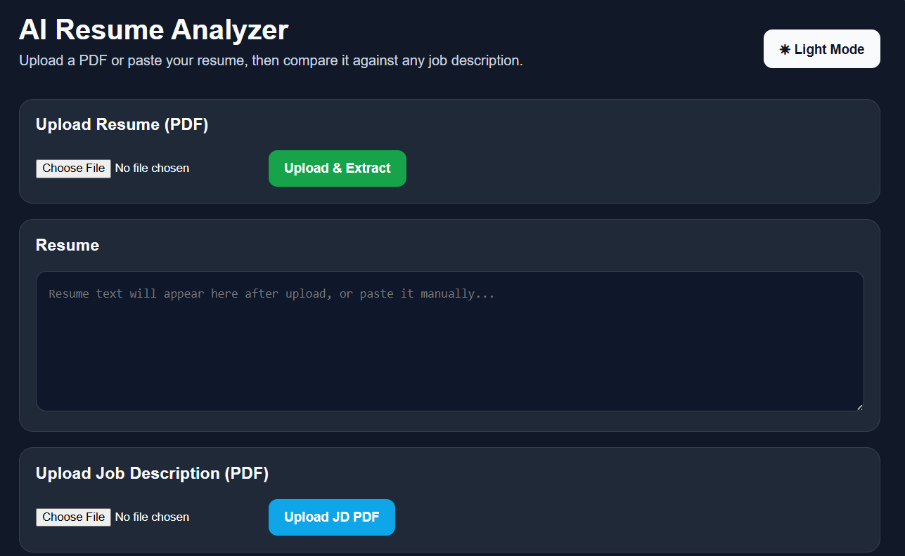
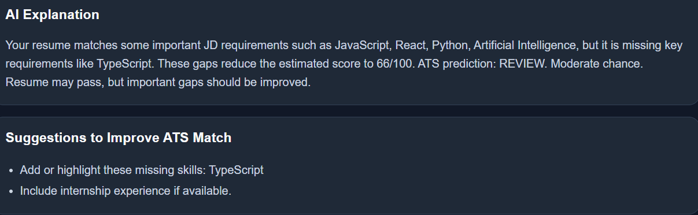
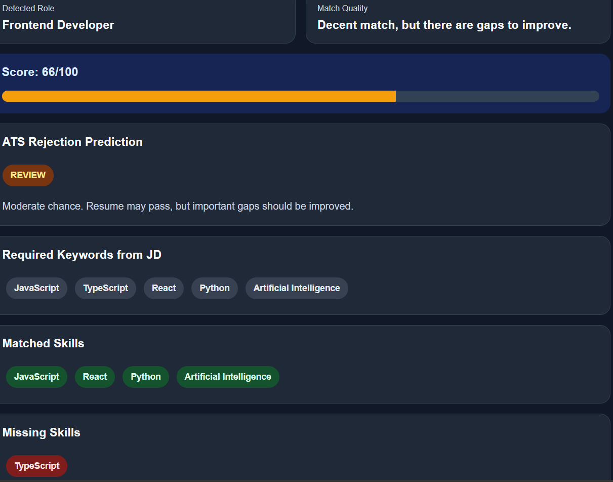
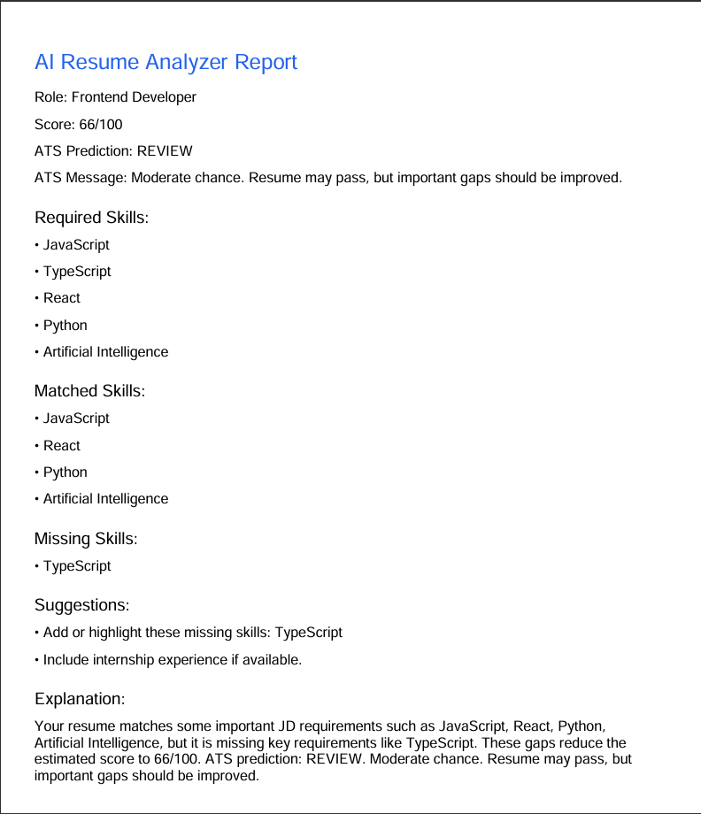

# 🤖 AI Resume Analyzer


An AI-powered web application that analyzes resumes against job descriptions to generate an ATS compatibility score, identify matched and missing skills, and provide AI-driven recommendations for improving resume quality.
---

## 🎯 Key Highlights

- 🚀 AI-powered ATS Resume Analyzer
- 🤖 OpenAI API Integration
- 📄 Intelligent PDF Parsing
- 📊 ATS Score & Skill Matching
- ⚡ Full Stack React + Node.js Application

---

##  **Live Application**

🌐 https://ai-resume-analyzer-eosin-six.vercel.app/

---

## ✨ Features

---

- 📄 Upload Resume (PDF)
- 💼 Upload Job Description (PDF)
- 🤖 AI-powered Resume Analysis
- 📊 ATS Compatibility Score
- ✅ Matched Skills Detection
- ❌ Missing Skills Identification
- 💡 Personalized Improvement Suggestions
- 📥 Download Analysis Report
- 📱 Responsive User Interface

---

# 📸 Screenshots

## 🏠 Home Page



---

## 📤 Upload Resume & Job Description



---

## 📊 Analysis Results



---

## 📄 Generated Report



---

## 🛠 Tech Stack

## 🛠 Tech Stack

| Category | Technologies |
|----------|--------------|
| Frontend | React.js, HTML5, CSS3 |
| Backend | Node.js, Express.js |
| AI | OpenAI API |
| Libraries | pdf-parse, jsPDF |
| Deployment | Vercel |

### Deployment
- Vercel

---

## Architecture Diagram 

                User
                  │
                  ▼
        React Frontend (Vercel)
                  │
         Upload Resume & JD
                  │
                  ▼
        Express.js Backend
                  │
      ┌───────────┴────────────┐
      │                        │
      ▼                        ▼
 PDF Parser              OpenAI API
      │                        │
      └───────────┬────────────┘
                  ▼
        ATS Analysis Engine
                  │
                  ▼
         Analysis Report (PDF)

--- 

## 📂 Project Structure

ai-resume-analyzer/
│
├── backend/
├── my-app/
├── screenshots/
├── README.md
├── .gitignore
└── LICENSE

---
       
## ⚙️ Installation

Clone the repository

```bash
git clone https://github.com/Prasanna-chinmalli/ai-resume-analyzer.git
```

Install frontend dependencies

```bash
cd my-app
npm install
npm start
```

Install backend dependencies

```bash
cd backend
npm install
npm start
```

---

## 🔑 Environment Variables

Create a `.env` file inside the backend directory.

```env
OPENAI_API_KEY=your_api_key
PORT=5000
```

---

## 📖 How It Works

1. Upload your Resume (PDF)
2. Upload the Job Description (PDF)
3. AI extracts and analyzes the content
4. View ATS Score
5. Review matched and missing skills
6. Download the generated report

---

## 🔮 Future Enhancements

- Resume History
- User Authentication
- Multiple Resume Comparison
- LinkedIn Profile Analysis
- AI Interview Preparation
- Multi-language Support

---

## 👨‍💻 Author

**Prasanna Chinmalli**

- GitHub: https://github.com/Prasanna-chinmalli
- LinkedIn: https://www.linkedin.com/in/prasanna-v-chinmalli-05175a278/